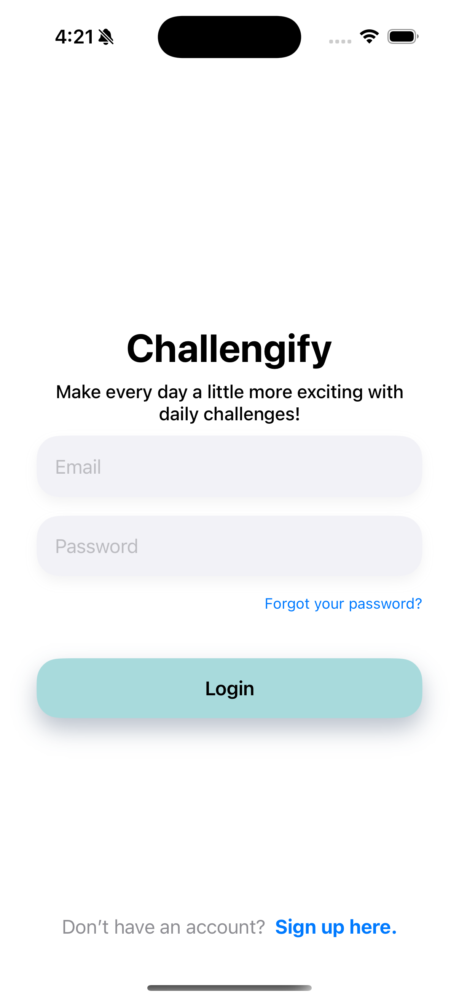

# Challengify

Challengify is a fun and casual daily challenge app that motivates users to complete simple tasks and track their progress. Whether you're aiming to build a new habit, stay productive, or just add a little excitement to your routine, Challengify is here to make your day more interesting!

## Features

- **Daily Challenges:** Get new challenges based on your interests every day.
- **Goal-Oriented Tasks:** Set your own personal goals and receive challenges tailored to help you achieve them.
- **Challenge Tracking:** Mark challenges as completed and track your progress over time.
- **Personalized Experience:** Customize your profile with your name, age, and goals.
- **Completion Proof:** Option to submit proof of completed challenges.
  
## Screenshots

## Getting Started

Follow these instructions to run **Challengify** locally on your machine.

### Prerequisites

- Xcode 14 or later
- iOS 16 or later
- SwiftUI
- Firebase (for authentication and Firestore database)

